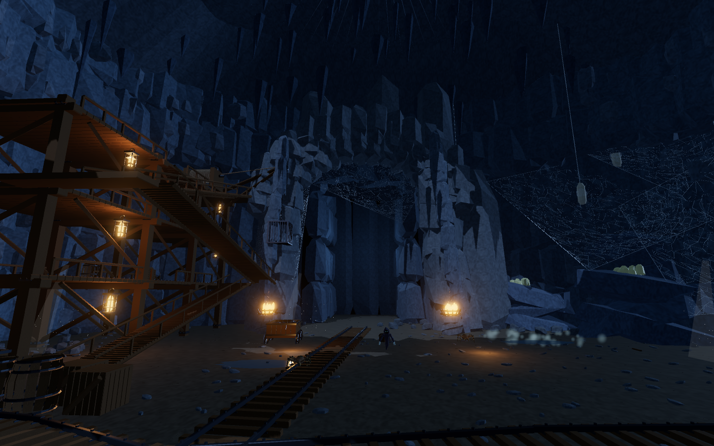
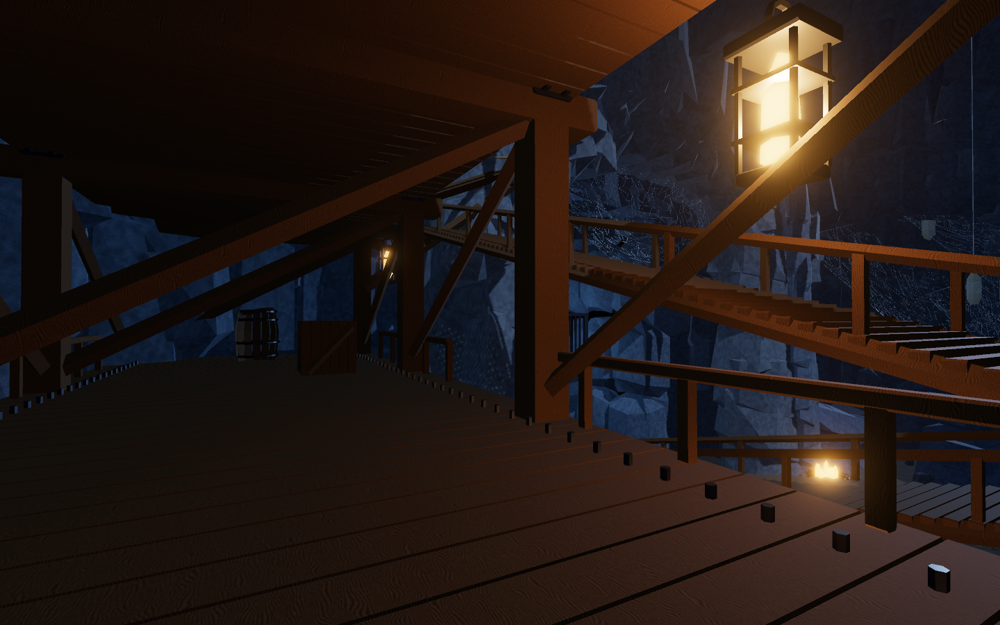

# The widow vault

The Shoulder Working's northern chamber is rebuilt from the saved [generated concept](concept.png). The editable [Blender scene](../../../assets/models/widow-vault/widow-vault.blend), procedural builders and exported glTF ship with the game under its MIT license.



The concept's principal forms have physical counterparts:

| Reference detail | Authored room |
| --- | --- |
| Tall natural vault and central arch | An irregular 88 m wide dome, a 47 m roof, layered rock piers and an explorable northern grotto |
| Timber mine gallery | Three decks at 6, 12 and 18 m, three 24 m stair flights, landing openings, braces, bolts, handrails and collision bodies |
| Mining machinery | A cable drum, pulley, linked chain, gently moving suspended cage and four ore wagons |
| Branching haul roads | Central, east and west rails, sleepers, fasteners and tunnel shoring |
| Silk nursery | Five irregular web sheets, five suspended cocoons and 48 eggs; all 25 attachment points are checked against exported rock |
| Working-mine clutter | Barrels, crates, pickaxes, discarded planks, layered rubble and shallow puddles |
| Cool cavern with warm work lights | Shadowed blue fill, local lantern pools, two braziers and existing library fire, embers, cave dust and mist |

The game keeps faceted low-poly rock and a readable haul road. The generated reference has denser surface weathering and different spider staging. The existing spiders, wraith, treasure and finite surface-mining rules remain active game entities.



## Rebuild and review

Use an existing Blender Lab bridge in an isolated background Blender process. The builder refuses to modify a foreground session. Install the [Blender fast skill](https://github.com/holokat/blender-fast) and follow its bridge setup guide. `BLENDER_FAST_SKILL` can point to that installation; the default is `~/.codex/skills/blender-fast`.

```sh
python3 tools/blender/widow/run.py --port 9877
python3 tools/blender/widow/run.py --port 9877 --render hero
node tools/blender/widow/validate.mjs
node src/world/widow_vault.test.mjs
node src/world/shoulder.test.mjs
npm run dev -- --config tools/widow-review.config.mjs --configLoader native
```

Open `http://127.0.0.1:5208/tools/review-widow.html` in your browser. The review uses the actual game renderer, layout, exported asset, creatures and ambient-effect registration. It saves four views, a narrow-viewport image, frame measurements and GPU-resource cleanup counts in `captures/`. The review server listens on loopback and is excluded from the production entry points.

The Blender builder uses seven bridge calls, direct mesh-data batches, Metal GPU only, MetalRT Auto, GPU OpenImageDenoise and persistent render data on the tested M2 Max. Renderer support is checked before constructing the scene. The `.blend` retains the material graph and review camera. `pack.py` translates its material colors to glTF, removes an unused duplicate vertex-color channel and packs normals as normalized 16-bit values. Exported position and index bytes are checked against their pre-packing hashes; no geometry is decimated.

## Verification

The asset has 262,734 triangles in 20 mesh/material batches and two embedded 512 px detail images. The game download is approximately 20 MB. [Build evidence](build-report.json) records exact bytes, hashes, renderer settings and separate construction/export/render times.

The runtime check walks 4,249 samples through the full stair flights, landings, decks, entrances and northern grotto. It checks visible stone mining, silk attachments, blocking walls and rails, spawn clearance, cage motion, independent material instances, failed downloads and teardown during a pending load. All existing mining checks and 13 Old Cellars integration suites pass. The production build passes.

The full repository test run still reports eight existing editor-fixture failures and the existing wayside timing threshold failure. These are also documented in the previous [Old Cellars verification](../old-cellars/verification.json); their thresholds and fixtures were preserved.

[Frame measurements](captures/widow-performance.json) are from Brave on the development M2 Max, with 120 measured frames after warmup at each viewport. They include scene update, rendering and a GPU finish. The narrow viewport measures layout and rendering on this Mac, not physical-phone performance. No player save is modified by the review.
