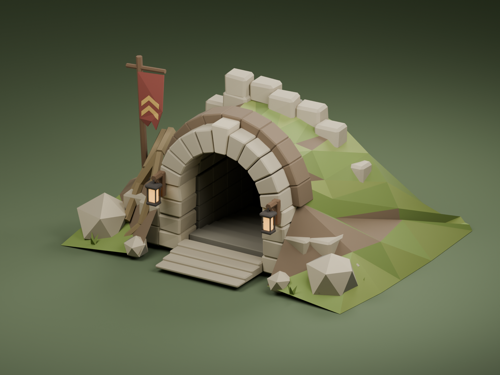

# Old Cellars exterior

The starting island's entrance is a turf-covered ruin with a broad stone arch,
visible threshold steps, a dark tunnel, roots, amber lanterns and a Legion banner.
It replaces the small detached arch, long straight wall and angular mud overlay.
The broken cart stands farther to the side so the larger approach stays clear.

The [generated concept](concept.png) was made with the built-in image-generation
tool. Its [prompt](prompt.md) specifies Brackenwake's chunky, faceted character
and tree style. The model uses geometry and vertex colors, with no image textures.
The three Blender review images are [front](front.png),
[three-quarter](three-quarter.png) and [side](side.png).

## Asset and placement

- Editable source: `assets/models/cellars/exterior/old-cellars-entrance.blend`.
- Runtime asset: `public/models/props/old_cellars_entrance.glb`.
- Builder: `scripts/art/cellars-exterior/build.py`, run inside Blender 5.2.
- The exported GLB is 572,920 bytes, with 6,721 triangles, two meshes, two
  materials, vertex colors, and no texture downloads or additional point lights.
- The asset is 10 metres wide and about 5 metres high. Its 2.8-metre-wide doorway
  is the origin, facing local +Z after glTF export. Buried lower edges remain
  below the terrain instead of shifting the whole object upward.
- The island plan retains its original dungeon position and 200-degree yaw.
  The prop loader preserves this authored origin. Collision follows the jambs,
  bank and header, with a shallow threshold ramp and an open central passage.
- The nearby exterior stair is above outdoor terrain. Entering still takes the
  player to the existing underground dungeon through the usual interaction.
- Existing dungeon interior assets and the other uses of `cellar_arch` are
  unchanged. The existing prop cache revision is retained, so adding this model
  does not invalidate every other structure asset.

## Verification

`node scripts/art/cellars-exterior/verify.mjs` inspects the shipped GLB, measures
its geometry, checks every attribute for finite values, verifies warm emission,
and raycasts the open passage with the masonry as a positive blocking control.

`node --test src/world/old_cellars_exterior.test.mjs` passes all three tests:
asset checks, actual loader and island-plan integration, and rotated/scaled
collision checks. The real interaction accepts entry nearby and refuses it
outside the normal reach. This is automated evidence, not a completed playtest.

The final Blender views were inspected for gaps, floating masonry, the banner's
attachment to the cloth, colors and silhouette. Final renders use Cycles at
1600 by 1200, 64 samples, Metal GPU only, MetalRT Auto and GPU OpenImageDenoise.
The existing Blender scene and its 978 objects were preserved. Preview metadata
was checked for absolute user paths.

The production build passes. The full npm suite completes with the existing
editor fixture-count failures and a wayside timing failure, measured at 2.48 ms
against its 2 ms limit. No fixture or timing threshold was changed. Focused asset
checks were repeated after the final geometry revision.

Browser verification is pending permission to use the existing Brave window,
which previously blocked automation while the user was playing. The isolated
playtest at `http://localhost:5210/tools/qa/cellars-exterior.html?solo` imports the
real game after installing temporary memory storage. It includes front/side
approaches, real entrance interaction, return, shader diagnostics and a test
achievement. It uses a protected temporary character and never reads player saves.
Production deployment remains pending that check.
