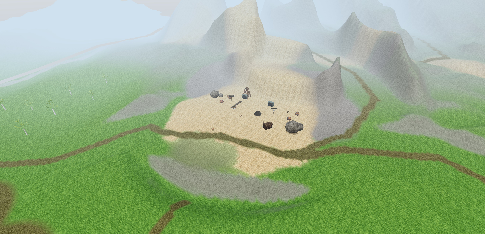

# Greenwold authoring pass

The later [country and living-world pass](DIVERSITY.md) extends this baseline
with interstitial landforms, groves, habitats and local lighting. Its counts
and measurements supersede the original-pass totals below.

The playable landscape follows the geography of the painted map and the
current Brackenwake canon. The source brief is [The Greenwold, space by
space](../22-GREENWOLD-SPACES.md); the story source is
[Brackenwake](../14-KALDERA.md), also published in the
[Brackenwake Codex](https://kaldera-codex.cogentgene.workers.dev/).

This pass builds the twelve subareas as connected places. It preserves the
original 1,712 terrain strokes and the user's tile spaces, then adds authored
landforms, graded routes, bridge surfaces and specific compositions. The saved
result has 131 Greenwold spaces and 4,976 terrain strokes. Tree placement uses
named, oriented groves with explicit arrangements, without placement jitter or
random scattering.

## The walk

Hearthhome is the starting hub. Its west lane opens through the Long Meadow
and reaches the mill. From the mill, the hollow way enters the Beech Hangar;
a higher ridge path returns above it. The quarry road climbs upstream into
the Chalk Pits, with a separate switchback to the rim. The chapel and the
Standing Hedge make an eastern return, while the towpath returns through the
Water Meadows and the Old Cellars. Coldwake has three approaches, so visiting
it does not require retracing one long lane.

The northern route offers a choice at Highwayman's Hollow: approach beneath
the lookout from the Kingsroad, or enter behind the tents from the Hedge.
Roads pass between solid buildings, with the gatehouse retained as an intended
passage. The inn and healer have clear approaches, the ridge return bends
around the miller's house, and the Coldwake cottage leaves the east lane open.
Open fields are left open where the route needs breathing room. Groves frame
banks, crossings and clearings; they are not a uniform layer over the map.

| Subarea | Composition and purpose | Playable connection |
| --- | --- | --- |
| Hearthhome | Buildings face the well and green. The smith, inn, healer and market occupy distinct edges; six story characters use the actual streets. | East lane to the Hedge, west lane to the meadow, bridge lane to the Cellars, Kingsroad north. |
| Standing Hedge | Nine separate stone clearings joined by the ring lane. Each stone is a real attunable travel destination. | Links the village, chapel, outlaw back path and southern fields. |
| Long Meadow | Oak and hay rick, open grass, cart rest and forage. Boars occupy the rough ground. | Main lane between village and mill; cutting down to the Cellars. |
| Mill Run | Mill, turning wheel, house, granary, field rows and a traversable crossing. Ivy uses the placed mill. | Meadow lane, hollow way, quarry approach and downstream bank. |
| Beech Hangar | Fallen trunk, setts and forage below mature beeches. Higher groves frame the ridge return. Old Grist appears after dark. | Low hollow way and high ridge loop to the mill; southern bridleway to Coldwake. |
| Chalk Pits | Three cut benches, working yard, headframe, mine mouths, rails and separate copper and tin deposits. | Quarry road, rim switchback and road east to the chapel landing. |
| Old Cellars | Brick entrance and Legion banner set in the riverbank, with guards nearby. The arch opens the existing Oram Blackhand dungeon. | Towpath, meadow cutting and village bridge lane. |
| Kingsroad | Paved approach, milestone, Legion tents, standard and Captain Serle Vane. The Tithe Wagon follows the authored road. | Village road and track up to the outlaw lookout. |
| Highwayman's Hollow | Tents and fire below the escarpment, lookout above the main approach, supplies inside the camp. | Exposed lookout track, mere path and sheltered back approach from the Hedge. |
| Sunken Chapel | Broken chapel on an island in the mere, shore graves and a narrow causeway. Ringing the bell brings the Skeleton Sexton and two skeletons with a temporary offering. | Causeway to the shared landing, then quarry, Hedge or outlaw camp. |
| Water Meadows | Willow banks, reeds, boat and rest beside the river crossing. Seasonal plants follow the bank. | Downstream to the Cellars, upstream to the mill, across to Coldwake. |
| Coldwake | Six cottages face a well and green, with a surrounding hedge and orchard behind. Its stone, kitchen and workbench work. | Bridleway to the wood, drovers return to the river and east lane to the Hedge. |

The chalk rim and beech overlook contain real, single-use supply caches. The
drovers rest marks the long southern return. Fingerposts give local directions
and set a real compass waypoint. These are placed at decisions and destinations.

## What reaches the player

- Story proximity checks, NPCs, crafting stations, map zones and travel stones
  resolve against the authored coordinates, rather than the earlier generated
  layout. Terrain and the prop library finish loading before character creation.
- All 822 authored harvestable trees and four ore deposits enter the real flora
  records used by picking and gathering. Seventeen forage patches enter the
  seasonal forage field, inventory and progression. A full pack leaves the
  plant available.
- Eight saved crossing profiles build their visible decks and their walkable
  surfaces from the same heights. Route grading is followed by recutting the
  river channel, so the approach banks do not dam it.
- The chapel offering lasts 60 seconds of the game clock. A second ring ends
  the truce immediately. Friendly actors become hostile through the real combat
  system, the offering expires through the ordinary loot system, and a saved
  claim prevents repeatedly collecting it after a reload.

## Structure library and distance

All 85 reviewed exports from the structure builder are imported into
`public/models/props`, used by existing placement IDs, and available as real
models in the editor's Structures library. Manifest revision hashes invalidate
old thumbnails when an asset changes. Source hashes and measured geometry
counts are in [structure-import.json](structure-import.json).

The imported models retain their close detail and atlas materials. Added index
levels share vertex data, reducing the combined geometry from 977,902 triangles
nearby to 292,190 at middle distance and 94,979 far away. The mill wheel keeps
its moving pivot through placement. Thin rail and road pieces retain visible
surfaces instead of disappearing beneath the fixed bedding depth. Bridge
approaches render only where their decks rise above the ground, avoiding
planks showing through the banks. Camp lamps and milestones follow the
Kingsroad bends; the obsolete crossing slab layout has been removed.

Terrain uses five 64-metre chunk rings, about 320 metres from the streaming
centre. Fog begins at 78.4 metres and closes at 280 metres. This restores the
intended fog after character creation and after leaving underwater views.
Crossing geometry is culled beyond 360 metres.

The imported library is 101,777,872 bytes. Seventy-five close-detail models still
exceed the original per-prop triangle limits; those limits were not relaxed or
reported as passing. Distance reduction is measured, but this pass does not
establish a frame-rate budget on lower-end hardware or under MMO population
load. Further source-mesh reduction can preserve the same placement IDs.

## Authoring and continued editing

- `scripts/author-greenwold.mjs` owns the `greenwold-craft` strokes, the authored
  groves and the population/dressing rows it writes. Its inputs are the focused
  modules in `scripts/greenwold` and the centre lines in
  `src/mmo/greenwold/routes.js`.
- The old scatter script refuses to overwrite this version. The new authoring
  script is repeatable, but rerunning it replaces its owned content, including
  later editor edits to those rows. Transfer deliberate editor revisions into
  the authoring sources before rerunning. User tile spaces remain separate.
- `scripts/import-studio-structures.mjs` validates the source export hashes and
  review status before importing. `scripts/structures/pack-glb.mjs` builds the
  distance levels without a new runtime dependency.
- Use the normal developer editor to place, move and save the imported assets.
  The library loads unplaced models as well as those already used in the zone.

## Verification

The authoring script and route audit also check the rotated footprints of
solid buildings, with 0.6 metres of clearance from the walking centre line.
This guards placement; it does not add general building-wall collision to the
existing character controller. A negative test places the inn directly on a
route and proves that the check rejects it. Hedges, walls and palisades are
cut back at the authored road corridors, including the three Coldwake
approaches. Their openings are checked separately and remain identical when
the authoring pass is repeated.

The saved landscape is tested with the actual `stepPlayer` controller at 60 Hz,
using the same terrain and bridge heights as the game. The audit covers all
30 routes forward and backward, walking and running. Running brakes into
bends; it does not claim that a player can take every hairpin at full speed.

The latest route run completed 120 traversals over 68,159 metres in 443,857
simulation frames, with no refused steps, stalls or route falls of 0.6 metres
or more. It sampled 68,297 route points at roughly 25-centimetre intervals.
Every sampled grade remained below the controller's slope limit.
The river is checked independently at 195 points along its 65 original channel
strokes.

The Greenwold regression suite drives real inventory, progression, chest,
interaction, story, encounter and travel consumers. It checks both proximity
outcomes, day and night, available and full inventory, first and repeated
claims, and the chapel's exact truce boundary. The asset suite checks all 85
library entries, placement schema, geometry indices, and distance selection
outward and back. A separate rendering regression checks shallow placements
and the mill wheel's actual pivot contract. Raycasts also verify that every wet
bridge segment has a visible deck and buried approaches do not. Crossing
geometry rebuilds when the terrain changes.

Browser review uses `tools/greenwold-playtest.html` in the existing Brave window.
It boots the real game and creates a character through the normal creation
screen after replacing storage with an in-memory store. User saves are never
opened. The optional local review bridge starts with
`node scripts/greenwold-review-server.mjs`; the game remains on port 5198.

The production build passes, as does `git diff --check`. The full automated
run passed all functional checks but failed two timing assertions: minimap
repainting reached 4.28 ms against 4 ms, and the synthetic 2,000-stroke terrain
benchmark reached 3.020 microseconds per sample against 3. A separate minimap
run passed at 3.37 ms worst. An earlier terrain recheck remained just over budget at
3.026 microseconds. Its final run passed all 221 checks at 2.876 microseconds
per sample after browser review stopped. Both timing checks have therefore
passed individual rechecks; the full-run timing failures remain recorded.
These thresholds remain unchanged. The Greenwold, bridge, asset, encounter and placement regressions
passed, including the 120 route traversals and 195 river samples.

Longer player sessions are still needed to judge encounter balance, first-hour
pacing and multiplayer behaviour; the route audit cannot measure whether an
encounter is fun.

## Browser review

The real in-memory game loaded all 85 structure models without reported browser
errors. The chapel bell was also activated through the real interaction entry
point, producing the three friendly actors and advancing the story flag. Saved
canvas views cover all twelve subareas. The Kingsroad alignment and trimmed
bridge approaches were visually checked after their corrections.

The final native Buildings tray check is complete. The reviewed model thumbnails
render and the inn can be selected for placement. The current library has 85
real models. The village was also reviewed after enlarging its buildings and
adjusting their clearances. No user save was read or changed.

The subsequent [weather and building scale pass](WEATHER-AND-SCALE.md) records
the current climate behaviour, clock fixes, building dimensions and validation.

The local build folder is about 293 MiB, the imported source models about
97 MiB, and temporary captures about 190 MiB before retaining the quarry view
here. `dist` can be rebuilt; `/tmp/kaldera-greenwold-review` contains review
captures and snapshots. They were left intact. Future captures use JPEG to
avoid the earlier 19 to 27 MB PNG files.

## Editor visual review

### Typography and grouping

| Before | After |
| --- | --- |
| `src/game/editor/panel.js` forced tray, section and status labels to uppercase in six CSS rules. | Removed those uppercase transforms. Existing mode groups retain distinct spacing. |
| `src/game/editor/palette.js` showed raw structure IDs with underscores. | Structure labels use readable sentence case; stable model IDs remain internal. |
| The structure tray could retain thumbnails for an older model with the same ID. | `src/game/editor/thumbs.js` includes the manifest revision in its thumbnail fingerprint. |
| No isolated review controls for traversing the twelve authored locations. | `tools/greenwold-playtest.html` groups location and play controls in one compact tray with 40-pixel control heights and a separated detail area. Its 18-pixel outer radius accommodates the inset 6-pixel control radius. |
