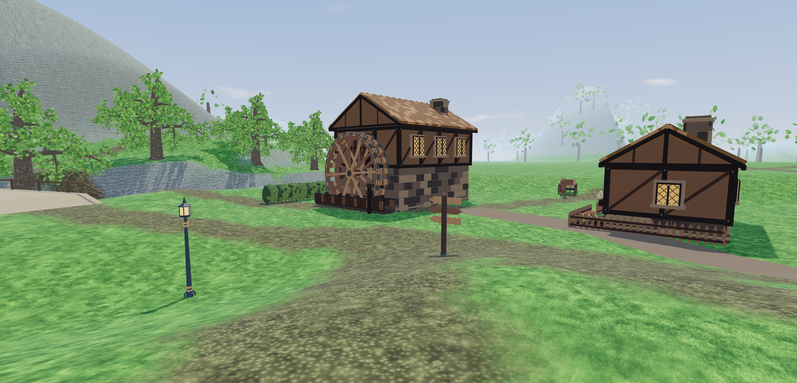
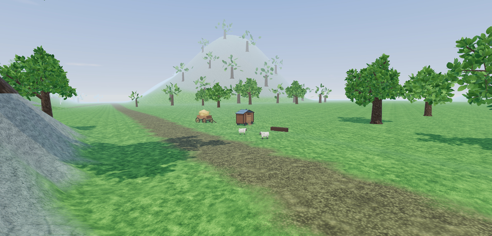
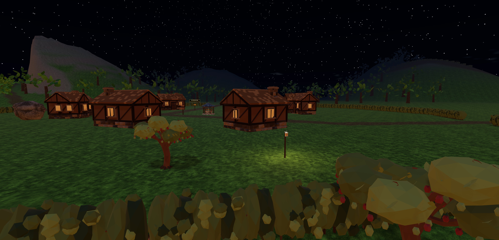

# Greenwold: the country between

This pass follows the request to make every subarea and its approaches more
varied. The earlier space brief left roads and views between destinations.
The current direction replaces those empty stretches with shaped countryside,
woodland interiors and small, purposeful places to stop.

| Place | Approach and landform | Local life and night character |
| --- | --- | --- |
| Hearthhome | Orchard shoulders and a low ridge outside the west gate. Keep the green level and the entrances open. | Working gardens, washing, stacked fuel and domestic animals. Warm light belongs to occupied yards. |
| Standing Hedge | A rolling ring of distinct knolls, wooded saddles and open stone clearings. | Gorse on exposed sides, fungi and fireflies at sheltered roots. The stones retain clear approaches. |
| Long Meadow | Broad grassy folds, with the haymakers lane dipping between them. | Hay work, grazing sheep and flower margins, with rough ground beyond the worked edge. |
| Mill Run | A settled working terrace in a deeper wooded valley. | Flour, spare millstones and river wildlife near the water. Keep its doors and crossing accessible. |
| Beech Hangar | A close hollow way below the raised beech ridge, with several forest chambers. | Charcoal work, a hunter's stop, fern banks and forage. Darker canopy, small firefly pockets and night threats. |
| Chalk Pits | Higher white shoulders, exposed buttresses and a twisting ascent. | Pit timber, flint and gorse on the dry edges. A warm survey light marks the worked rim. |
| Old Cellars | A cutting enclosed by wooded banks, opening onto the guarded arch. | Abandoned ground and damp vegetation. The entrance lantern contrasts with the dark bank. |
| Kingsroad | A ridge-and-saddle road with a screened bend before the Legion camp. | Maintained road furniture, watch fire and signs of traffic. The open road differs from the wooded shortcut. |
| Highwayman's Hollow | A camp revealed only after rounding its screening hill. | Stolen goods, a watched approach and a sheltered back route. Firelight stays inside the hollow. |
| Sunken Chapel | A wet basin enclosed by higher wooded shores, with its island and causeway intact. | Drowned walls, reeds and low mist. Cold points of light stay near the haunted water. |
| Water Meadows | Low wet folds, raised dry banks and willow corridors. | Herons, ducks, iris and dragonflies at water, with mist after dark. Preserve floodplain openness locally. |
| Coldwake | A sheltered village behind southern downland shoulders, reached through wooded folds and pasture. | Orchard work, a duck pond and livestock. Warm domestic light against dark hills. |

## Acceptance checks

- Compare saved before/after terrain at all twelve destinations and along every route.
- Retain the 25% building scale and keep building ground floors and arrivals usable.
- Run the real controller in both directions, walking and running, on every route.
- Check the river separately from bridge walkability.
- Measure terrain sightline screening at authored reveal points, not just hill height.
- Every new decoration and effect belongs to a named composition with a reason.
- New forage and ambushes use real gameplay records, with dry, reachable placements.
- Import the studio source with a recorded hash and reuse Three.js without new packages.
- Bound effect visibility, update distance and lights. Test day, night and underground.
- Review the actual game at each destination and representative stretches between them.
- Record measured results and any remaining limits here before finishing.

## What changed

The country now has 62 additional authored landforms and 72 additional groves.
The complete Greenwold has 124 named grove compositions and 1,994 harvestable
trees. The saved terrain has 5,066 strokes. Tree positions come from explicit,
oriented arrangements, with the trunks checked against the roads and working
areas. These are saved placements, not runtime scatter.

Thirty-six named habitat and working compositions add 118 props, 11 animated
animals, 16 real forage patches, two supply caches and four encounters. Three
of the new encounters are restricted to night. Each composition carries a
reason for its contents in [habitats.js](../../../src/mmo/greenwold/habitats.js).
Eight short graded footpaths lead into the new off-road stops. The rest sit
beside existing routes or inside reachable clearings.

The living studio contributes working-yard pieces, riverbank plants, woodland
dressing, animals and effects. The imported source dependency closure contains
60 files, totaling 458,375 bytes. The [import receipt](living-import.json)
records every file hash; 38 match files listed in the studio's verification
report, with zero mismatches. The other 22 are support files copied with their
own recorded hashes. No package was added.

All 94 dressing models are also available in the existing builder library,
alongside the 85 structure models. Builder props use a baked pose and one draw
per geometry instance group. The 11 authored habitat animals instead use the
studio's live animation functions. Those animals provide ambient movement;
they are not new combat creatures or a livestock simulation.

## The space between destinations

The relief survey samples the routes every 35 metres and measures the height
range within 70 metres of each point. These are median local relief values,
not road gradients or the elevation gained by the player.

| Route | Before | After |
| --- | ---: | ---: |
| Mill lane | 3.49 m | 24.92 m |
| Haymakers lane | 3.54 m | 37.40 m |
| Hollow way | 12.22 m | 28.26 m |
| Kingsroad | 2.75 m | 28.92 m |
| Cellar cutting | 3.24 m | 30.58 m |
| Chalk switchback | 45.38 m | 61.84 m |

All 30 routes increased in median local relief. The village green, mill yard,
chapel causeway and selected floodplain openings retain flatter ground where
people need room to work, gather or see the water. The full survey and sampled
sightlines are in [diversity-measurements.json](diversity-measurements.json).

The terrain itself hides the centre of Highwayman's Hollow from the lookout
track at 138.5 metres, then clears the sightline near the camp. The controller
access test checks this reveal separately from route walkability. The other
surveyed destinations do not all become fully terrain-occluded: woodland and
road bends provide additional framing there. No universal hidden-camp claim
is made from the presence of hills alone.

Visual review found that the quarry's first river spur crowded the mill and
its wheel. The spur was moved east, preserving the wooded valley while opening
the working terrace again. The west-gate screen was also moved outside the
village footprint. Large props are checked across their rotated footprint,
not just at their centre, and the small habitat clearings were graded to keep
them seated.

## Light, weather and local effects

Thirty-three effect placements have specific homes: smoke at work sites,
fireflies in sheltered vegetation, mist at damp or haunted water, dust on dry
chalk, and drifting leaves or pollen beneath trees. Fair-weather insects and
pollen turn off during substantial rain or snow. These local effects reuse
the existing climate state; they do not add another rain or snow system.

Seven authored light positions serve occupied orchards, watchfires, the quarry
rim, the cellar entrance and the chapel. Warm inhabited places contrast with
the chapel's colder light. Wooded corridors blend into darker canopy lighting
without changing the clock or the night predicates used by combat and story.
The existing 25-minute day/night cycle and regional weather remain connected.

At most six effects within 80 metres, six animals within 65 metres and four
lights within 45 metres are active. Dressing props cull at 105 or 150 metres,
depending on their size. Terrain retains its five chunk rings, about 320 metres,
with the existing weather-adjusted fog around the 280-metre default. Nothing
in this pass increases world view distance.

The real-game review covered all twelve subareas, additional intermediate
stops and seven close night views. A GPU comparison with the living layer
visible and hidden measured 385 changed pixels at the fern fireflies, 16,295
at the chapel and 6,029 at the Hollow watchfire, each out of 197,120 pixels.
These differences confirm visible output from the active layer, not a frame
rate guarantee. The layer includes local light and any nearby animal as well
as particles. Runtime and shader error lists were empty. The recorded probes
are in [living-review.json](living-review.json).

## Verification and limits

| Check | Measured result |
| --- | --- |
| Existing route controller audit | 120 walking/running traversals in both directions; 443,857 frames and 68,159 m travelled. |
| New side-path controller audit | 32 walking/running traversals; 7,036 frames, without blocked passages, falls, water entries or stalls. |
| River and existing gameplay | 195 river samples, eight bridge profiles, 22 building ground floors, arrivals, four ores and seven stations pass the Greenwold audit. |
| Habitat footprints | All 118 props are dry, clear of the road centre, and within the one-metre corner-height span check. |
| Forage and caches | All 16 new patches reach the actual forage and inventory path; distance and already-picked cases pass. Both caches reject distant use and duplicate opening. |
| Animals and encounters | Animation changes actual model transforms. Day/night spawn predicates are tested in both states. |
| Lifecycle and distance | Selection caps, weather gates, underground hiding, return, disposal, terrain-edit reanchoring and near/far/near prop LOD transitions pass. |
| Sculpt-world runtime | 183 checks pass. The blank-sculpt assertion now distinguishes six real authored trees near the test origin from generated flora. |
| Build and whitespace | Production build passes; `git diff --check` passes. Existing bundle-size and GLTFLoader import warnings remain. |

The broad `npm test` run passed the new gameplay and route suites but was not
fully green. After fixing the authored-tree assertion, that suite passed its
rerun. Two existing timing gates on the generated-world path still fail their
isolated reruns: minimap repaint median 2.92 ms, worst 4.76 ms against a 4 ms
worst-case limit; wayside construction worst median 2.07 ms against a 2 ms
limit. Their limits were not relaxed. This pass does not establish frame rate
on lower-end hardware or with a populated MMO server. The inherited detailed
structure mesh budget remains documented in [ARCHITECT.md](ARCHITECT.md).

Visual review uses the actual game and source assets in the existing Brave
browser, through an isolated review page with in-memory storage. User saves
were not read, edited or replaced. Some saved review images include developer
labels; those labels are not the normal play interface.

| Interface review | Result |
| --- | --- |
| Builder model labels | The new entries use readable names in sentence case; internal `lw_` IDs stay in the data. |
| Grouping and spacing | The existing Structures library grouping and control spacing are retained. This pass adds assets, not another panel or overlay. |

## Authoring checkpoint

The main inputs are [journeys.mjs](../../../scripts/greenwold/journeys.mjs) for
landforms and groves, [habitats.js](../../../src/mmo/greenwold/habitats.js) for
local compositions, and [habitats.mjs](../../../scripts/greenwold/habitats.mjs)
for their terrain and saved-space writer. Run `node scripts/author-greenwold.mjs`
after updating those sources. It owns the `greenwold-craft` terrain strokes and
its generated grove/habitat files; move intentional editor changes to those
inputs before regenerating. Other user tiles remain separate.

Runtime behaviour is isolated in `src/world/living`, with catalog and schema
modules in `src/mmo`. The vendored studio code is left intact. Source upgrades
should update the receipt and rerun `src/world/living/living.test.mjs`,
`src/world/living/access.test.mjs` and the Greenwold controller audit. The relief
comparison also needs an explicit before-terrain file; its checked-in JSON is
the measurement from this pass, not a dependency on the temporary review files.
