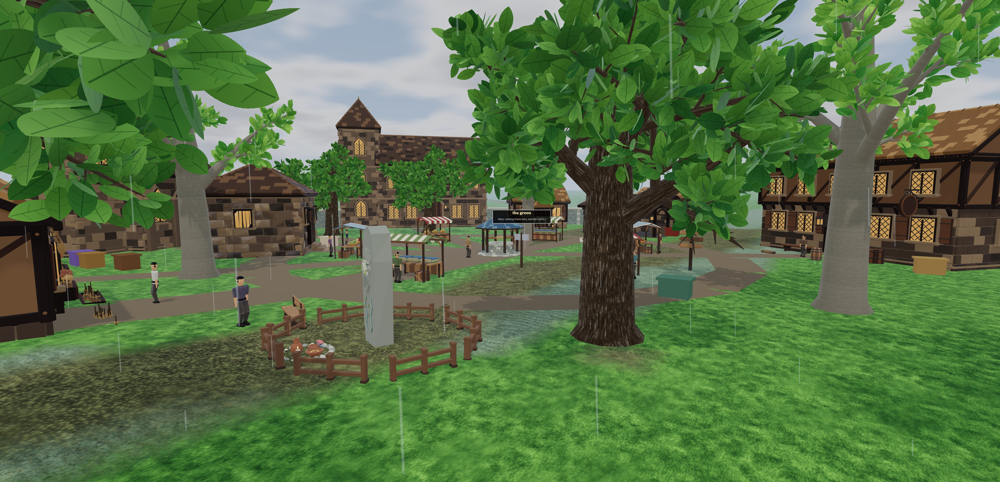
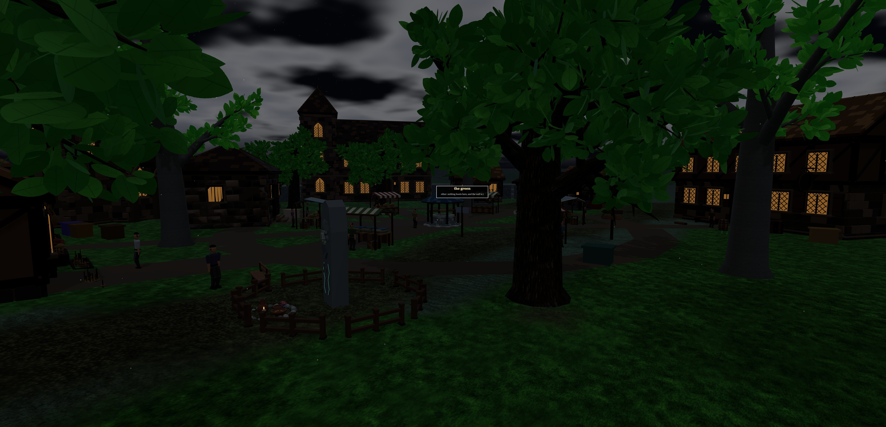
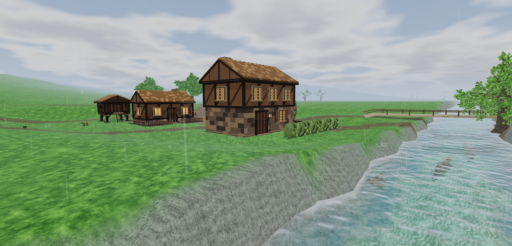
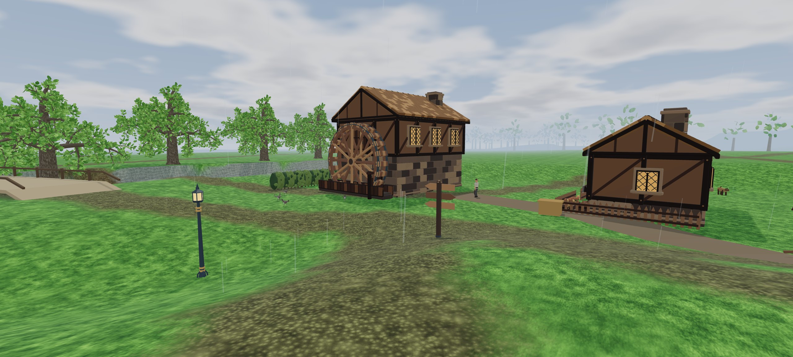

# Weather and building scale

The 22 authored Greenwold buildings now use a saved placement scale of 1.25.
The inn is 17.5 metres wide, 11.25 deep and 11.25 tall. The source library
keeps its original metre dimensions, so an editor placement can still choose
its own scale. Trees, furnishings, market stalls and user-authored tiles were
not enlarged.

The original doors were mostly physically plausible for the 1.8 metre
character: the inn's opening measured 2.69 metres, the cottages roughly 2.19
to 2.27, and the foreman's hut 1.88. The larger placements give the buildings
more presence beside Greenwold's mature trees. These measurements refer to
the original scale; the new placement multiplies them by 1.25.

## Settlement adjustments

The bank and its banker, two Coldwake cottages, three crafting stations and
the stable paddock have new positions that clear the expanded footprints.
The paddock sits in the dry western yard, with an opening through the wall
and a short lane back toward the stable. Hearthhome's review/travel arrival
is on the village green; its former arrival was beside the bridge in water.

The mill, miller's house and raised granary share an authored working terrace
at 12 metres elevation. Nine samples across each enlarged footprint are level.
This corrects the former 2.29-metre ground variation that buried the mill's
ground floor. Its broad shoulder eases back into the bank, and the river
channel is recut afterwards to preserve flow. Every enlarged building now
has a regression check for excessive ground variation.

The mill wheel now follows the reviewed mill model's actual axle socket.
Both horizontal position and axle height come from the parent's position,
rotation and scale. Previously the attachment tag only exempted the wheel
from an overlap check. A rendering regression now measures the actual
wheel pivot against that socket. The final in-game front and rear captures
confirm that the ground floor is visible and the wheel meets the mill wall.

The placement pass is idempotent. Building footprint audits, NPC placement
checks, the paddock's dry-ground samples and every authored arrival pass.
All 120 walking/running route traversals pass again after enlargement.
The expanded footprints also had no nearby tree-trunk conflicts in the
placement inspection. General building-wall collision remains outside this
pass; the character controller's existing behaviour is unchanged.

## Where weather belongs

| Realm | Automatic weather |
| --- | --- |
| Greenwold | Clear spells, gathering cloud and passing rain. Local mist and wind change around its twelve subareas. |
| Verdant | Damp woodland, more cloud and mist, sheltered wind. |
| Saltmarch | Windy coastal rain and sea haze. |
| Stormpeaks | Exposed wind and rain, converting to snow at the terrain's snow band. |
| Frostreach | Snow, including a light flurry between heavier bands. |
| Sunken Kingdom | Humid cloud, rain and stronger mist. |
| Ember Wastes | Dry air and drifting dust. |
| Boneyard | Dust, haze and wind. |
| Ashen Throne | Dry, dusty air under heavier cloud. |

Within Greenwold, the Mill Run, Sunken Chapel and Water Meadows have the
strongest damp-air treatment. Beech Hangar and Highwayman's Hollow are
cloudier and more sheltered. The Chalk Pits and Kingsroad are more exposed.
Hearthhome is calmer. Coldwake remains a farming hamlet; its name does not
make it a snow biome. Snow uses the actual ground height and terrain snow
band, never the developer camera's height.

An authored 47-minute front moves through clear, overcast, rain and clearing
conditions. It interpolates continuously in time and across places. Existing
realm sky colours remain underneath the changing cloud, mist and light.
The developer bench has Local weather, Clear, Overcast, Rain, Snow, Mist and
Dust previews. A preview can deliberately show snow in the village; normal
weather there does not.

## Day, night and rendering

Brackenwake's current clock is a 25-minute cycle, with the sun above the horizon
for 20 minutes and below for five. Weather, the visible sun, nocturnal story
checks and developer time controls now use the same world clock, including
dragon time changes. Storms dim the lighting without falsely activating
night-only encounters. The developer readout also includes its time offset.

Environment reflection captures now centre the sky and include its full
dome distance. Previously the capture's far plane stopped before the dome.
Water shares the live sky's cloud and weather uniforms.

Precipitation occupies a 24-metre radius around the camera. Rain uses one
batch of 960 small streak quads; snow and dust share one batch of 640 points.
Fair weather draws neither. A local 32 by 32 cover texture clips particles
against terrain, water, authored bridge decks and building roof envelopes.
The cover rebuilds after seven metres of travel or a relevant world change.
The final village review saw 14 nearby roof envelopes and cover rebuilds of
about 6 to 7 ms in the foreground. Background review while sharing the GPU
also recorded rebuilds around 40 ms, so these are observations rather than a
frame-time guarantee. This work is periodic, not performed every frame. Particle
geometry and the cover texture are disposed with the world.

Roof coverage is conservative at roughly two-metre resolution. It is not
triangle-exact around eaves, open sheds or tree canopies. Dungeon and
underwater views hide precipitation. This pass does not add snow accumulation,
wet-ground materials, weather audio, seasons or server-synchronised weather.

The existing view limits remain: terrain streams to roughly 320 metres and
ordinary fog ends at 280 metres. Weather shortens that fog range. The distant
sky dome does not require more distant terrain or object loading.

## Verification

The production build passes. Targeted checks cover all nine climates and
twelve Greenwold air profiles, dry and frozen realms, elevation transitions,
interpolation, pause/slowdown behaviour, shelter updates, resource disposal,
rendered sky uniforms and all 1,500 seconds of the day cycle. The cycle test
counts 1,200 seconds with the sun above the horizon and 300 below.

The real game was reviewed in an existing Brave window using an isolated
in-memory character. The Buildings tray displayed the imported models and
allowed selecting the inn. No user save was opened or changed.

An actual GPU comparison renders the same scene with precipitation visible
and hidden. At 640 by 308 pixels, rain changed 992 pixels in the village view.
This check caught a zero-width rain geometry bug that draw-call counts and
shader compilation checks had missed. The corrected rain is visible in the
retained village capture. A separate snow-only comparison changed 984 pixels, with the rain batch
hidden. The live night check reported a day factor of zero and sun height
of -0.841; the sky and ground agreed after correcting the isolated review
control to use the world clock. The browser reported no runtime or shader
errors. Snow shown at Hearthhome was an explicit developer preview.

The full automated run passed its functional checks but failed one timing
assertion: the synthetic 2,000-stroke terrain benchmark measured 3.036
microseconds per sample against its unchanged 3-microsecond limit. This is
not reported as a clean full-suite pass. One isolated recheck also exceeded
that limit at 3.235 microseconds, with 220 of 221 checks passing. The later sky, weather, editor,
developer-clock, placement, attachment and route checks pass individually.

